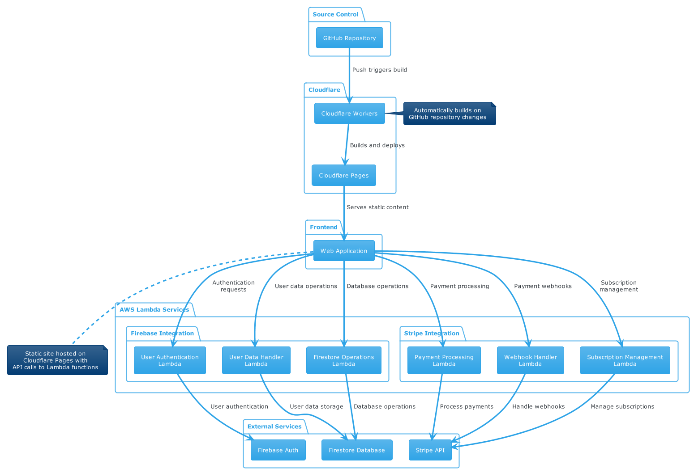

# CI/CD Demo

This repository is a monorepo for the CI/CD Demo project, designed to showcase advanced web integrations and CI/CD pipeline experience. The project features a modern frontend hosted on Cloudflare Pages, a suite of backend serverless Lambda services, and secure user data management with Firestore and Firebase Authentication.

## Project Overview

- **Frontend**: Built with React and TypeScript, the frontend is deployed on Cloudflare Pages for fast, global delivery. Users can upload CVs, receive ATS reports, and interact with the platform through a responsive web interface.
- **Backend**: All backend logic is implemented as serverless Lambda functions, providing scalable APIs for user management, Stripe payment processing, and CV analysis.
- **User Data & Authentication**: User profiles and data are securely stored in Google Firestore. Authentication and authorization are handled via Firebase Authentication, ensuring robust security and easy integration with the frontend.
- **CI/CD**: The project is structured for seamless CI/CD integration, enabling automated testing, building, and deployment of both frontend and backend components.

## Project Structure

- **frontend/**: React + TypeScript web application, deployed to Cloudflare Pages.
  - **src/**: Main application source code (components, services, types, etc.)
  - **public/**, **dist/**: Build and static assets
- **firestore-lambda-get-profile/**: Lambda function for retrieving user profiles from Firestore.
- **firestore-lamda-user-service/**: Lambda function for user management and Firestore integration.
- **firestore-lambda-decrement-credits/**: Lambda function for atomic credit decrement (used for credit deduction on actions).
- **stripe-create-checkout/**: Lambda function for creating Stripe checkout sessions.
- **stripe-webhook-processor/**: Lambda function for processing Stripe webhook events.
- **stripe-webhook-receiver/**: Lambda function for receiving Stripe webhook events.
- **text/**: (Optional) Contains sample or template files for testing or demo purposes.
- **README.md**: Project documentation (this file).

## Pipeline Architecture




## Getting Started

### Prerequisites
- Node.js (v16 or higher recommended)
- npm or yarn
- Firebase/Firestore and Stripe accounts for backend services
- Cloudflare account for frontend deployment

### Setup
1. Clone the repository:
   ```sh
   git clone https://github.com/GrantC27/ci-cd-demo.git
   cd ci-cd-demo
   ```
2. Install dependencies for each sub-project:
   ```sh
   cd frontend && npm install
   cd ../firestore-lambda-get-profile && npm install
   cd ../firestore-lamda-user-service && npm install
   cd ../stripe-create-checkout && npm install
   cd ../stripe-webhook-processor && npm install
   cd ../stripe-webhook-receiver && npm install
   ```

### Running the Frontend Locally
```sh
cd frontend
npm run dev
```

### Deploying the Frontend
- Configure your Cloudflare Pages project to use the `frontend` directory as the root.
- Set up your build command (e.g., `npm run build`) and output directory (e.g., `dist`).
- Connect your GitHub repository for automatic deployments on push.

### Running Backend Services Locally
Each backend service can be started individually. For example:
```sh
cd firestore-lamda-user-service
node index.mjs
```

### Deploying Backend Services
- Package each backend directory and deploy as a Lambda function using your preferred cloud provider (e.g., AWS Lambda, Google Cloud Functions).
- Set environment variables and service account keys as needed for Firebase, Firestore, and Stripe integration.

## Security & Authentication
- User authentication is managed by Firebase Authentication.
- All sensitive user data is stored in Firestore, with access controlled by security rules and authentication tokens.

## CI/CD
- The repository is structured for easy integration with CI/CD tools (e.g., GitHub Actions, Cloudflare Pages, AWS/GCP deployment pipelines).
- Automated workflows can be set up to test, build, and deploy both frontend and backend on every commit.

## License
This project is licensed for personal use only.
